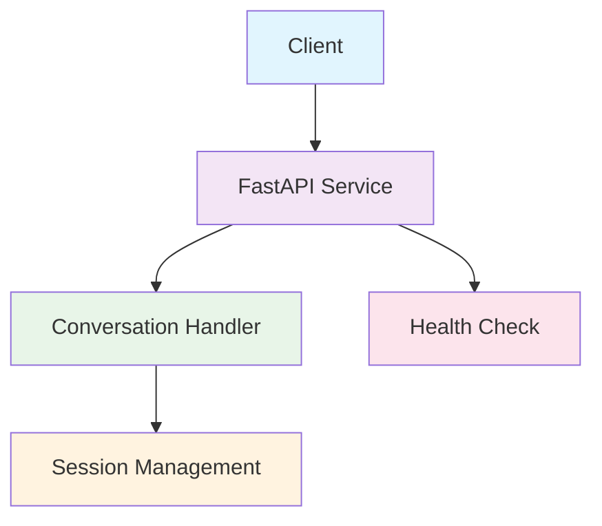

# Luma - Healthcare Conversational AI Service

A conversational AI service for healthcare appointment management, built with FastAPI.

## Architecture Overview

### System Design



### Technology Stack

| Component | Technology | Purpose |
|-----------|------------|---------|
| **API Framework** | FastAPI + Uvicorn | High-performance async web framework |
| **Type System** | Pydantic + SQLModel | Runtime validation and type safety |
| **LLM Integration** | Anthropic SDK | Direct Claude API integration |
| **Package Management** | uv | Fast Python dependency management |
| **Code Quality** | Ruff + MyPy | Linting, formatting, and type checking |
| **Containerization** | Docker | Simplify local development and deployment |
| **Task Automation** | Justfile | Development workflow automation |

## Setup

### Prerequisites

- `just` command runner

All other dependencies (Python 3.13, Docker, uv) are installed automatically via the setup process.

### Quick Start

1. **Install just** (if not already installed)
   ```bash
   # macOS
   brew install just

   # Linux
   curl --proto '=https' --tlsv1.2 -sSf https://just.systems/install.sh | bash -s -- --to ~/bin

   # Windows
   scoop install just
   ```

2. **Clone the repository**
   ```bash
   git clone <repository-url>
   cd luma
   ```

3. **Set up the development environment**
   ```bash
   just setup
   ```
   This will:
   - Install uv (if not present)
   - Install Python 3.13
   - Create virtual environment
   - Install all dependencies
   - Set up pre-commit hooks

4. **Activate the virtual environment**
   ```bash
   just activate
   ```

5. **Start the development server**
   ```bash
   just dev
   ```

6. **Test the API**
   ```bash
   curl -X POST http://localhost:9001/conversation \
     -H "Content-Type: application/json" \
     -d '{"message": "Hello, I need help with my appointments"}'
   ```

## Development Workflow

### Daily Development

1. **Start development server with hot reload**
   ```bash
   just dev_reload
   ```

2. **Run code quality checks**
   ```bash
   just check  # Runs lint, typecheck, and security scan
   ```

3. **Fix linting issues**
   ```bash
   just lint_fix
   ```

4. **Run tests**
   ```bash
   just test
   ```

### Pre-commit Hooks

Pre-commit hooks automatically run on every commit:
- Code formatting (Ruff)
- Linting (Ruff)
- Type checking (MyPy)
- Security scanning (Bandit)
- File format validation
- Docker linting (Hadolint)

To run pre-commit manually:
```bash
just run_precommit --all-files
```

### Project Structure

```
luma/
├── app/
│   ├── __init__.py
│   ├── main.py              # FastAPI application entry point
│   ├── api/
│   │   ├── __init__.py
│   │   └── endpoints.py     # API route handlers
│   ├── models/
│   │   ├── __init__.py
│   │   └── conversation.py  # Pydantic data models
│   └── services/
│       └── __init__.py      # Business logic services
├── tests/                   # Test suite
├── Dockerfile              # Container definition
├── justfile                # Task automation
├── pyproject.toml          # Project configuration
├── uv.lock                 # Dependency lockfile
└── README.md               # This file
```

## Architecture Details

### Current Implementation

The service currently provides:

1. **Basic Conversation Flow**: Keyword-based canned responses
2. **Session Management**: CUID-based session identifiers
3. **Health Monitoring**: Status endpoint with version info
4. **Type Safety**: Pydantic models for request/response validation

### Data Models

See [`app/models/conversation.py`](app/models/conversation.py) for the complete data model definitions:

- `ConversationRequest` - API request format
- `ConversationResponse` - API response format
- `HealthResponse` - Health check response format

*Currently in Phase 1 (MVP with canned responses)*

## Docker Deployment

### Building the Image

```bash
just build
```

### Running in Docker

```bash
# Standard deployment
just run_docker

# With environment file
just run_docker_env  # Requires .env file
```

## Testing

- `just test_health` - Test health endpoint
- `just test_api` - Test conversation endpoint
- `just test` - Run test suite
- `just test_watch` - Run tests in watch mode

## API Documentation

FastAPI automatically generates interactive API documentation:

- `just docs` - Open Swagger UI in browser
- Visit `http://localhost:9001/docs` - Interactive Swagger UI
- Visit `http://localhost:9001/redoc` - Alternative ReDoc interface

## Configuration

### Environment Variables

| Variable | Description | Default |
|----------|-------------|---------|
| `ANTHROPIC_API_KEY` | Claude API key | Required for Phase 2+ |
| `PORT` | Server port | 8000 |
| `LOG_LEVEL` | Logging level | info |

### Development Configuration

All configuration is managed through:
- `pyproject.toml`: Project metadata and tool configuration
- `justfile`: Development commands and variables
- `.env`: Environment-specific settings (not committed)

## Useful Commands

- `just setup` - Complete development environment setup
- `just dev` - Start development server with hot reload
- `just check` - Run all quality checks (lint, typecheck, security)
- `just test_api` - Test the conversation endpoint
- `just build && just run_docker` - Build and run in Docker
