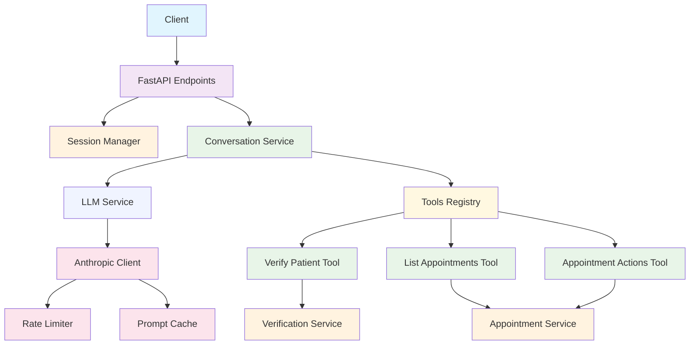
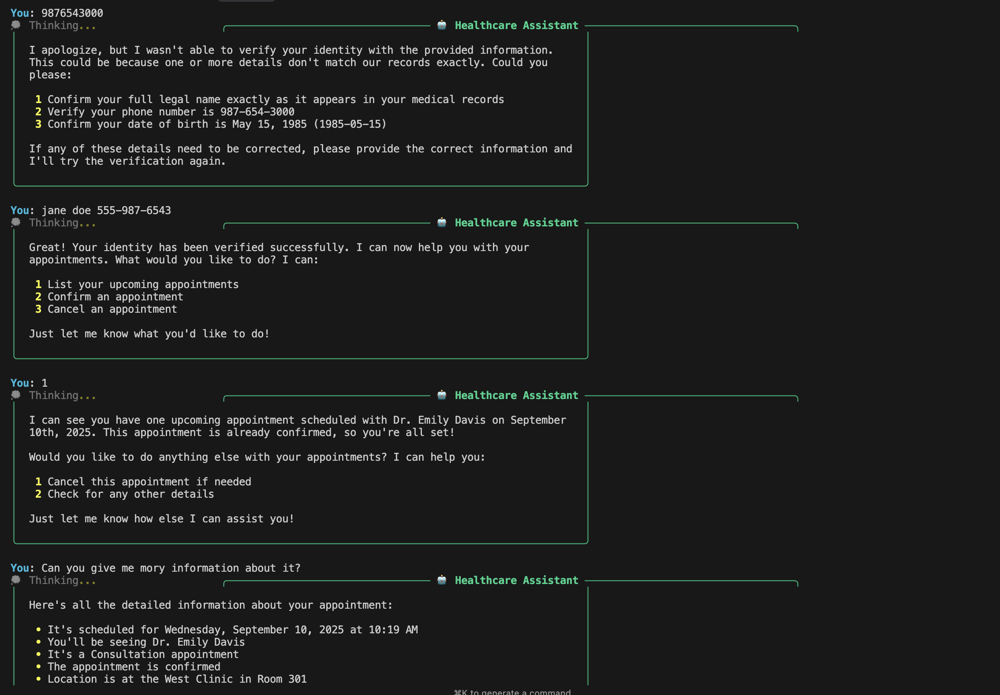

# Luma - Healthcare Conversational AI Service

A conversational AI service for healthcare appointment management, built with FastAPI.

## Architecture Overview

### System Design



### Technology Stack

| Component | Technology | Purpose |
|-----------|------------|---------|
| **API Framework** | FastAPI + Uvicorn | High-performance async web framework |
| **Type System** | Pydantic | Runtime validation and type safety |
| **LLM Integration** | Anthropic SDK | Direct Claude API integration |
| **Package Management** | uv | Fast Python dependency management |
| **Code Quality** | Ruff + MyPy | Linting, formatting, and type checking |
| **Containerization** | Docker | Simplify local development and deployment |
| **Task Automation** | Justfile | Development workflow automation |

## Setup

### Prerequisites

- `just` command runner

All other dependencies (Python 3.13, Docker, uv) are installed automatically via the setup process.

### Quick Start

1. **Install just** (if not already installed)
   ```bash
   # macOS
   brew install just

   # Linux
   curl --proto '=https' --tlsv1.2 -sSf https://just.systems/install.sh | bash -s -- --to ~/bin

   # Windows
   scoop install just
   ```

2. **Clone the repository**
   ```bash
   git clone <repository-url>
   cd luma
   ```

3. **Set up the development environment**
   ```bash
   just setup
   ```
   This will:
   - Install uv (if not present)
   - Install Python 3.13
   - Create virtual environment
   - Install all dependencies
   - Set up pre-commit hooks

4. **Activate the virtual environment**
   ```bash
   just activate
   ```

5. **Start the development server**
   ```bash
   just dev
   ```

6. **Set up environment variables**
   ```bash
   echo "ANTHROPIC_API_KEY=your_api_key_here" > .env
   ```

7. **Test the system interactively**
   ```bash
   just chat
   ```

## Usage Guide

### Interactive Testing

The easiest way to test the system is with the interactive chat interface:



```bash
just chat
```

This command will:
- Verify your environment is set up correctly
- Check that your Anthropic API key is configured
- Start the service in Docker
- Launch an interactive CLI for testing

### Example Conversation Flow

1. **Start verification**:
   ```
   You: Hello, I need help with my appointments
   Assistant: I'll help you with your appointments! First, I need to verify your identity...
   ```

2. **Provide verification details**:
   ```
   You: My name is John Smith, phone 555-123-4567, born 1980-01-01
   Assistant: Identity verified successfully! You can now access your appointment information.
   ```

3. **List appointments**:
   ```
   You: Show me my appointments
   Assistant: Here are your upcoming appointments:
   📅 APT_001 - Tuesday, September 3, 2024 at 09:00 AM
      Provider: Dr. Sarah Johnson
      Type: Annual Physical
      Status: Scheduled
      Location: Main Clinic - Room 101
   ```

4. **Confirm appointment**:
   ```
   You: Confirm APT_001
   Assistant: ✅ Appointment APT_001 has been confirmed successfully!
   ```

## Development Workflow

### Daily Development

1. **Start development server with hot reload**
   ```bash
   just dev_reload
   ```

2. **Run code quality checks**
   ```bash
   just check  # Runs lint, typecheck, and security scan
   ```

3. **Fix linting issues**
   ```bash
   just lint_fix
   ```

4. **Run tests**
   ```bash
   just test
   ```

### Pre-commit Hooks

Pre-commit hooks automatically run on every commit:
- Code formatting (Ruff)
- Linting (Ruff)
- Type checking (MyPy)
- Security scanning (Bandit)
- File format validation
- Docker linting (Hadolint)

To run pre-commit manually:
```bash
just run_precommit --all-files
```

### Project Structure

```
luma/
├── app/
│   ├── __init__.py
│   ├── main.py              # FastAPI application entry point
│   ├── api/
│   │   ├── __init__.py
│   │   └── endpoints.py     # API route handlers
│   ├── clients/
│   │   ├── __init__.py
│   │   └── anthropic.py     # Anthropic API client with rate limiting
│   ├── models/
│   │   ├── __init__.py
│   │   ├── conversation.py  # API request/response models
│   │   ├── session.py       # Session and conversation history
│   │   ├── patient.py       # Patient business model
│   │   ├── llm.py          # LLM abstractions and content blocks
│   │   └── messages.py      # Message and tool call models
│   ├── services/
│   │   ├── __init__.py
│   │   ├── conversation.py  # Conversation flow orchestration
│   │   ├── llm.py          # High-level LLM operations
│   │   ├── session_manager.py # In-memory session management
│   │   ├── verification.py  # Patient verification service
│   │   └── appointments.py  # Appointment management service
│   ├── tools/
│   │   ├── __init__.py
│   │   ├── base.py         # Tool definitions and types
│   │   ├── registry.py     # Tool registry and management
│   │   ├── verify_patient.py # Patient verification tool
│   │   ├── list_appointments.py # Appointment listing tool
│   │   └── appointment_actions.py # Confirm/cancel tools
│   └── utils/
│       ├── __init__.py
│       └── logging.py      # Logging configuration
├── tests/                  # Test suite
├── Dockerfile             # Container definition
├── justfile               # Task automation
├── pyproject.toml         # Project configuration
├── uv.lock                # Dependency lockfile
└── README.md              # This file
```

## Architecture Details

### Current Implementation

The service provides a complete conversational AI system with:

1. **Claude Integration**: Direct Anthropic API integration with tool calling
2. **Patient Verification**: Hash-based identity verification with test patients
3. **Appointment Management**: In-memory appointment listing, confirmation, and cancellation
4. **Session Management**: CUID-based session identifiers with automatic cleanup
5. **Tool System**: Modular tool registry with Pydantic validation
6. **Prompt Caching**: Automatic caching of tool definitions for cost optimization
7. **Type Safety**: Full type safety with provider-agnostic abstractions
8. **Comprehensive Logging**: Structured logging with module identification

### Service Architecture

```
API Endpoints → Conversation Service → LLM Service → Anthropic Client
                     ↓                      ↓
              Tools Registry          Rate Limiting
                     ↓
        Verification + Appointment Services
```

### Data Models

- [`app/models/conversation.py`](app/models/conversation.py) - API request/response models
- [`app/models/session.py`](app/models/session.py) - Session and conversation history
- [`app/models/patient.py`](app/models/patient.py) - Patient business model
- [`app/models/llm.py`](app/models/llm.py) - LLM abstractions and content blocks
- [`app/models/messages.py`](app/models/messages.py) - Message and tool call models

### Tools

- [`app/tools/verify_patient.py`](app/tools/verify_patient.py) - Patient identity verification
- [`app/tools/list_appointments.py`](app/tools/list_appointments.py) - Appointment listing
- [`app/tools/appointment_actions.py`](app/tools/appointment_actions.py) - Confirm/cancel appointments

## Docker Deployment

### Building the Image

```bash
just build
```

### Running in Docker

```bash
# Standard deployment
just run_docker

# With environment file
just run_docker_env  # Requires .env file
```

## Testing

- `just test_health` - Test health endpoint
- `just test_api` - Test conversation endpoint
- `just test` - Run test suite
- `just test_watch` - Run tests in watch mode

## API Documentation

FastAPI automatically generates interactive API documentation:

- `just docs` - Open Swagger UI in browser
- Visit `http://localhost:9001/docs` - Interactive Swagger UI
- Visit `http://localhost:9001/redoc` - Alternative ReDoc interface

## Configuration

### Environment Variables

| Variable | Description | Default |
|----------|-------------|---------|
| `ANTHROPIC_API_KEY` | Claude API key | Required for Phase 2+ |
| `PORT` | Server port | 8000 |
| `LOG_LEVEL` | Logging level | info |

### Development Configuration

All configuration is managed through:
- `pyproject.toml`: Project metadata and tool configuration
- `justfile`: Development commands and variables
- `.env`: Environment-specific settings (not committed)

## Useful Commands

- `just setup` - Complete development environment setup
- `just dev` - Start development server with hot reload
- `just check` - Run all quality checks (lint, typecheck, security)
- `just test_api` - Test the conversation endpoint
- `just build && just run_docker` - Build and run in Docker

## Potential Future Improvements

The current implementation provides an initial foundation. Future enhancements could include:

### Data Persistence
- **DynamoDB for conversations**: Store conversation history separately from session management to better support compliance needs and horizontal scaling
- **PostgreSQL for sessions**: Persistent session management
- **Encryption at rest**: Encrypt sensitive patient information in storage layers

### Local Development Infrastructure
- **Docker Compose**: Multi-service local development with databases
- **Database migrations**: Automated schema management and versioning

### Security Enhancements
- **Sensitive data tokenization**: If no BAA exists with LLM provider, tokenize sensitive data instead of sending it as plain text. Integrate into tool definitions.

### Architecture Improvements
- **Dependency injection**: Replace singleton pattern with proper DI container for flexibility

### Scalability Features
If needed at scale:
- **Redis caching**: Caching layer for session management
- **Rate limiting**: Per-user and global rate limiting strategies

### Integration Capabilities
- **EHR system integration**: Real patient verification and appointment data
- **Multi-channel support**: SMS, voice, web chat adapters
